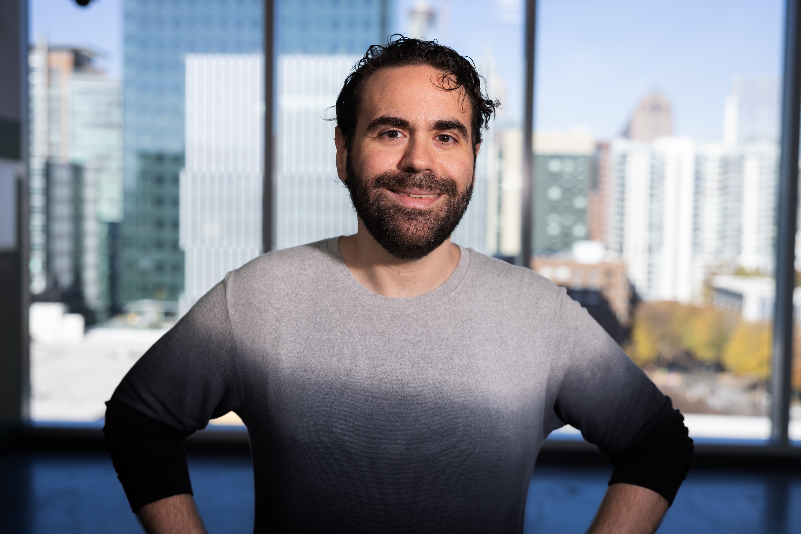

::: {.hero-section}
::: {.hero-content style="display: grid; grid-template-columns: auto 1fr; gap: 3rem; align-items: center; max-width: 900px; margin: 0 auto;"}

{.profile-image width="180px"}

::: {.hero-text}
# Glenn Matlin

[PhD Student • Georgia Tech • MATS Scholar]{.tagline}

::: {.social-links style="margin-top: 1.5rem;"}
[<i class="bi bi-github"></i>](https://github.com/glennmatlin){.social-link aria-label="GitHub"}
[<i class="bi bi-linkedin"></i>](https://linkedin.com/in/glennmatlin){.social-link aria-label="LinkedIn"}
[<i class="bi bi-envelope"></i>](#contact-email){.social-link aria-label="Email"}
:::

[Download CV](cv/glenn-matlin-cv.pdf){.btn-outline-navy style="border-color: rgba(255,255,255,0.8); color: white; margin-top: 1.5rem;"} [Resume](cv/glenn-matlin-resume.pdf){.btn-outline-navy style="border-color: rgba(255,255,255,0.8); color: white; margin-top: 1.5rem;"}
:::

:::
:::

:::::: {.container style="max-width: 1100px; margin: 0 auto; padding: 0 1.5rem;"}

::: {.home-section .reveal}

I got my start building computers and setting up networks for small businesses when I was a teenager. That curiosity about how systems work never went away -- it just shifted from hardware to data to machine learning to the questions I work on now.

After studying economics at UCF, I spent years as a data scientist in industry -- detecting rare diseases at Komodo Health, building NLP systems that processed millions of clinical records at Change Healthcare, and developing credit models at LendUp. Each role taught me something about what happens when models meet the real world: the gap between what a system optimizes for and what people actually need.

That gap brought me back to school. I'm a PhD student in computer science at Georgia Tech, advised by Mark Riedl and Sudheer Chava. My research sits at the intersection of language models and high-stakes decision-making -- how do we build AI that reasons well enough to be trusted in domains like finance, security, and healthcare? I've published work at ACL, COLM, NeurIPS, and EMNLP, and received support from DARPA and Together AI.

Right now I'm a [MATS](https://www.matsprogram.org/) Scholar, working on AI safety policy. The questions that interest me most are about how AI systems learn about humans from our data, how they generalize from those patterns, and how to make sure the results are trustworthy.

:::

::::::

::: {.connect-section .reveal}
::: {.connect-inner}

### Let's Connect

I'm always interested in discussing research collaborations, interesting problems, and new opportunities.

::: {.connect-links}
[<i class="bi bi-envelope"></i> Get in Touch](#contact-email){.connect-link}
[<i class="bi bi-github"></i> GitHub](https://github.com/glennmatlin){.connect-link}
[<i class="bi bi-linkedin"></i> LinkedIn](https://linkedin.com/in/glennmatlin){.connect-link}
[<i class="bi bi-file-pdf"></i> Download CV](cv/glenn-matlin-cv.pdf){.connect-link}
[<i class="bi bi-file-pdf"></i> Resume](cv/glenn-matlin-resume.pdf){.connect-link}
:::

:::
:::
